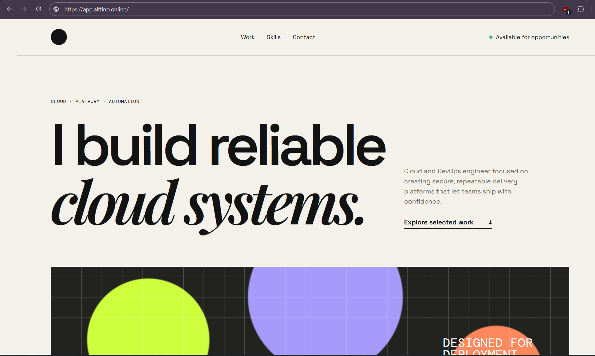
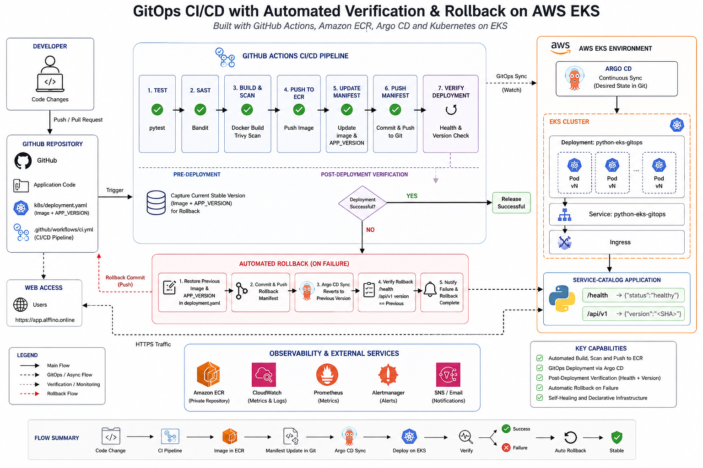

# Python EKS GitOps Platform

A production-style DevSecOps project that deploys a containerized Python application to Amazon EKS using GitHub Actions, Amazon ECR, Argo CD, AWS Application Load Balancer, Route 53, ACM, and Terraform.

The project focuses on secure GitOps delivery, least-privilege AWS access, automated deployment verification and rollback, TLS-enabled application exposure, Kubernetes workload hardening, and cost-aware EKS operations.

## Application

The application is a Flask-based, single-page Cloud and DevOps portfolio. It also provides health, readiness, API metadata, and version endpoints used by Kubernetes and the deployment pipeline.

The environment is intentionally designed to be disposable, so the application may not remain publicly available after the project is completed. The screenshot below captures the deployed application while the EKS environment was running.



## Architecture



The diagram shows the complete delivery path from a source-code change through testing, security scanning, ECR publishing, Argo CD synchronization, deployment verification, and GitOps rollback.

## Technology Stack

- **Application:** Python 3.12, Flask
- **Containers:** Docker
- **Container Registry:** Amazon ECR
- **Kubernetes:** Amazon EKS
- **Infrastructure as Code:** Terraform
- **GitOps:** Argo CD
- **CI/CD:** GitHub Actions
- **Ingress:** AWS Load Balancer Controller + Application Load Balancer
- **DNS:** Amazon Route 53
- **TLS:** AWS Certificate Manager
- **Security Scanning:** Bandit, Trivy
- **AWS Authentication:** GitHub OIDC to IAM

## CI/CD and GitOps Workflow

Every application change pushed to `main` passes through the CI/CD pipeline before deployment.

The workflow performs:

1. Python tests with `pytest`.
2. Static application security testing with Bandit.
3. Docker image build.
4. Container vulnerability scanning with Trivy.
5. Authentication to AWS using GitHub OIDC.
6. Push of an immutable Git-SHA-tagged image to Amazon ECR.
7. Update of `k8s/deployment.yaml` with the new image SHA and `APP_VERSION`.
8. Commit of the desired deployment state back to Git.
9. Automatic synchronization by Argo CD.
10. Post-deployment health and version verification.

Git remains the source of truth for the deployed state. Argo CD continuously reconciles the Kubernetes cluster with the manifests stored in Git.

## Automated Deployment Verification and Rollback

Before a release is deployed, the pipeline records the currently stable image and application version.

After Argo CD deploys the new version, GitHub Actions verifies:

```text
GET /health
GET /api/v1
```

The deployment is accepted only when:

- `/health` reports the application as healthy.
- `/api/v1` reports the exact Git SHA expected by the deployment pipeline.

If verification fails within the configured retry window, the pipeline automatically restores the previous stable image and `APP_VERSION` in the GitOps manifest and pushes a rollback commit.

Argo CD then detects the rollback commit and reconciles EKS back to the previous stable release.

This keeps rollback consistent with GitOps principles. A direct `kubectl rollout undo` is not used as the primary rollback method because Argo CD self-healing could otherwise restore the version still declared in Git.

## Security Design

### Least-Privilege AWS Access

GitHub Actions authenticates to AWS using **OIDC federation**, avoiding long-lived AWS access keys in repository secrets.

Separate IAM roles are used for different responsibilities rather than using a single administrator identity. For example, the image publishing workflow uses a dedicated ECR role with only the permissions required for container publishing.

This reduces the blast radius of compromised CI/CD credentials.

### Restricted EKS API Access

The EKS public API endpoint is restricted to the administrator's current public IPv4 address using a `/32` CIDR instead of allowing access from `0.0.0.0/0`.

```text
<ADMIN_PUBLIC_IP>/32
```

Private endpoint access is also enabled.

Because the administrator IP can change, the CIDR is managed through Terraform and can be updated before accessing the cluster from a new public IP.

### Kubernetes Workload Hardening

The application Deployment includes:

- non-root user and group
- `allowPrivilegeEscalation: false`
- all Linux capabilities dropped
- `RuntimeDefault` seccomp profile
- read-only root filesystem
- dedicated writable `/tmp` volume
- CPU and memory requests/limits
- readiness and liveness probes
- multiple application replicas

### DevSecOps Controls

The CI pipeline includes:

- `pytest` for application tests
- Bandit for Python SAST
- Trivy for HIGH and CRITICAL container vulnerabilities
- immutable container tags based on Git commit SHA
- private Amazon ECR
- OIDC-based AWS authentication
- deployment health verification before accepting a release

## SSL/TLS, DNS and Application Exposure

The application and Argo CD UI were exposed through AWS Application Load Balancers.

A wildcard ACM certificate was created for:

```text
*.alffino.online
```

ACM ownership validation was completed using Route 53 DNS validation.

During the implementation, Route 53 records were configured for:

```text
app.alffino.online
argocd.alffino.online
```

The ALBs exposed HTTPS on port 443 using the ACM certificate, while HTTP traffic on port 80 was redirected to HTTPS. Requests flow through Route 53, the ALB, Kubernetes Ingress and Service, then to the application pods.

The DNS records and running EKS environment can be removed when the project is not in use without affecting the repository, architecture, or implementation documentation.

## Kubernetes Deployment

The application runs with two replicas and exposes operational endpoints:

```text
/health
/ready
/api/v1
```

Kubernetes uses `/ready` for readiness checks and `/health` for liveness checks.

`/api/v1` includes the deployed `APP_VERSION`, which allows the pipeline to confirm that the exact Git SHA intended for deployment is actually serving traffic behind the ALB.

## Infrastructure Design

Terraform is organized into reusable VPC and EKS modules.

The environment includes:

- VPC
- public and private subnets across multiple Availability Zones
- Internet Gateway
- NAT Gateway
- EKS control plane
- managed EKS node group
- IAM roles and EKS access configuration

Worker nodes run in private subnets without public IP addresses and use the NAT Gateway for required outbound connectivity.

The EKS API is available through controlled public access for administration and private access within the VPC.

## Cost Optimization and Environment Suspension

Because the environment is intended for learning and demonstration, it does not need to run continuously.

The EKS managed node group can be scaled to zero when the platform is not in use:

```bash
aws eks update-nodegroup-config   --cluster-name python-eks-gitops   --nodegroup-name default   --region ap-south-1   --scaling-config minSize=0,desiredSize=0,maxSize=2
```

The environment can later be resumed with:

```bash
aws eks update-nodegroup-config   --cluster-name python-eks-gitops   --nodegroup-name default   --region ap-south-1   --scaling-config minSize=1,desiredSize=2,maxSize=2
```

This procedure was validated by scaling the worker count to zero and later restoring two nodes. After the nodes returned to `Ready`, Argo CD, the AWS Load Balancer Controller, and the application workloads recovered successfully.

Scaling workers to zero reduces EC2 compute cost, although the EKS control plane, NAT Gateway, and ALBs can still incur charges. The entire environment can also be destroyed when it is no longer required.

## Operational Verification

Typical validation commands used during deployment and recovery:

```bash
kubectl get nodes
kubectl get pods -A
kubectl get ingress -A
```

Check the running image:

```bash
kubectl get deployment python-eks-gitops   -o jsonpath='{.spec.template.spec.containers[0].image}{"\n"}'
```

Check application health while the environment is running:

```bash
curl https://app.alffino.online/health
```

Check the exact deployed version:

```bash
curl https://app.alffino.online/api/v1
```

## Project Highlights

- Built a modular AWS EKS environment using Terraform.
- Implemented GitOps deployment and self-healing with Argo CD.
- Built a GitHub Actions pipeline with testing, SAST, container scanning, ECR publishing, deployment verification, and automated rollback.
- Used GitHub OIDC and purpose-specific IAM roles instead of long-lived AWS credentials.
- Restricted EKS API access to a specific administrator `/32` CIDR.
- Deployed worker nodes in private subnets.
- Hardened Kubernetes workloads with non-root execution, seccomp, dropped capabilities, a read-only root filesystem, resource controls, and health probes.
- Published immutable SHA-tagged images to private Amazon ECR.
- Exposed the application through AWS ALB with Route 53 DNS and ACM-managed HTTPS.
- Secured both the application and Argo CD UI with TLS.
- Implemented GitOps-compatible automatic rollback based on external health and version verification.
- Validated environment suspend and resume by scaling EKS worker capacity to zero and restoring it on demand.
